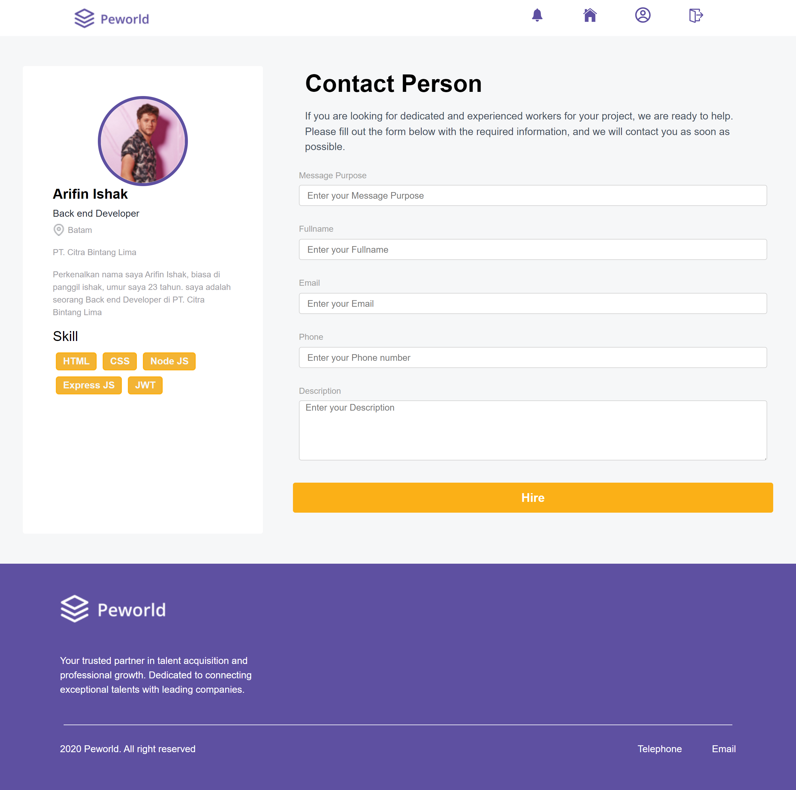

<p align="center">
  
</p>

<h1 align="center">
    <a href="https://git.io/typing-svg"></a>
</h1>

## Table of Contents

- [Introduction](#introduction)
- [Tech Stack](#Tech-Stack)
- [Features](#features)
- [Requirements](#requirements)
- [Instalation](#instalation)
- [Create Environment Variable](#create-environment-variable)
- [Screenshots](#screenshots)
- [Release Demo](#Demo)
- [Related Project](#related-project-backend)
- [Developed](#Developed)
- [License](#License)
- [Contact](#Contact)


## introduction

Peworld is a job search & worker recruitment website. On this website, user workers can post personal data information along with the portfolio that the user worker has. Recruiters can upload job vacancies & make hires.


## Tech Stack

**Programming language:** JavaScript (React Vite)

**Framework:** SCSS

**State Management:** Redux Thunk

**HTTP Client:** Axios

[](https://skillicons.dev)


## Features

✨ Update & Information Management: Makes it easy for workers to update their personal data, portfolio and skills efficiently.

✨ Upload and Upload Profile Picture: Provides intuitive features for uploading and updating user profile pictures, increasing account personalization.

✨ Worker Search: Implement an advanced search system that helps recruiters find the best candidates quickly.

✨ Upload Job Vacancies: Allows recruiters to upload job vacancies easily and quickly.

✨ Hire: Provides features for recruiters to search for suitable workers and carry out the hiring process directly on the platform & etc.


## Requirements

- [`npm`](https://www.npmjs.com/get-npm)
- [`Vite`](https://vitejs.dev/guide/)
- [`Vite-cli`](https://vitejs.dev/guide/cli.html)
- [`SASS`](https://sass-lang.com/documentation/)
- [`Backend Peworld`](https://github.com/crossxjonathan/peworld-backend)


## Instalation
- [`Vite`](https://medium.com/@miahossain8888/how-to-create-a-react-app-with-vite-571883b100ef)

#### Clone this repository

```bash
   git clone https://github.com/crossxjonathan/hirejob-pijar.git
```

#### Install Depedencies

```bash
   npm install
```

#### Start Project

```bash
   npm run dev
```


## Create Environment Variable

If you want to run this environment, you need to add the following environment variables to your .env file

setup server: 

`VITE_URL_PEWORD`

## Screenshots

<div align="center">
    <p>Login Page</p>   
       
    <p>Register Page</p>   
       
    <p>Landing Page</p>   
       
</div>
<div align="center" style="display: flex; flex-direction: column; align-items: center; margin: 20px;">
    <p>Home</p>   
       
    <p>Profile Worker & Experience</p>   
       
    <p>Profile Worker & Portfolio</p>   
       
    <p>Edit Profile Worker</p>   
       
</div>
<div align="center" style="display: flex; flex-direction: column; align-items: center; margin: 20px;">
    <p>Profile Recruiter</p>   
       
    <p>Edit Profile Recruiter</p>   
       
    <p>Hire</p>    
       
    <p>History</p>    
       
</div>


## Release Demo
- [`Demo`](https://peworld-fwm19.vercel.app/)


## Related Project (Backend)

- [`Backend Peworld`](https://github.com/crossxjonathan/peworld-backend.git)


## Developed :

💻 [@crossxjonathan](https://github.com/crossxjonathan) as FullStack

## License :

-This project is licensed under the MIT License. Please refer to the [LICENSE](./LICENSE) file for further details

## Contact :
📧 firman.jonathan6398@gmail.com
🔗 https://www.linkedin.com/in/firman-jonathan/
